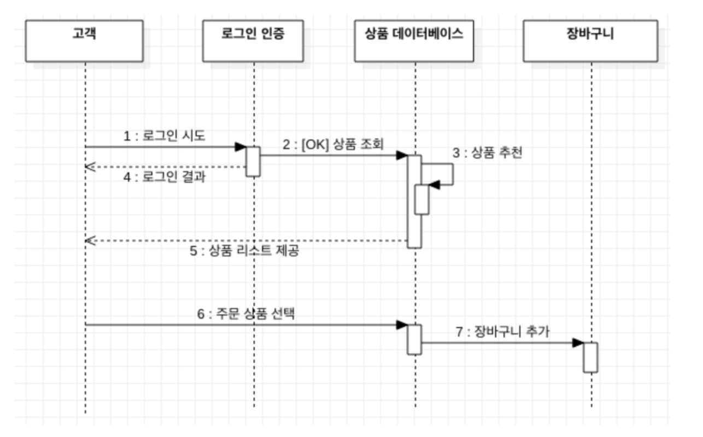
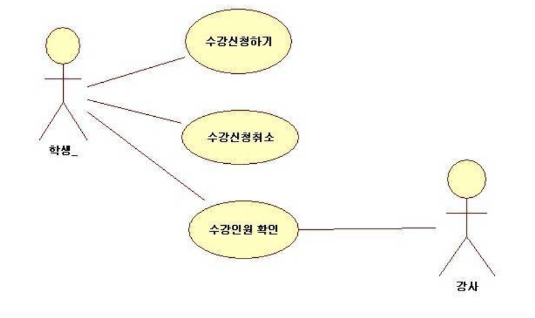

# UML
소프트웨어 청사진 - 소프트웨어 중심 시스템의 산출물을 가시화하고, 명세화하고, 구축하고, 문서화하는데 사용

시스템을 모델로 표현해주는 대표적인 모델링 언어

## 필요성
시스템을 개념적으로 표현하는 모델이 필요, 시스템의 구조적 문제와 팀내의 의사소통

## 구성요소
사물: 추상적 개념
관계: 연결 관계를 추상화
다이어그램: 관련성이 있는 사물들 간의 상호관계

## UML 다이어그램의 종류
Structure Diagram
- 클래스: 시스템을 구성하는 클래스
- 객체: 객체 사이의 정적인 관계(클래스 다이어그램을 구체화)
- 배치: 노드에 존재하는 컴포넌트의 물리적 구성을 표현(시스템 소프트웨어 - 하드웨어 컴포넌트)
- 컴포넌트: 물리적 단위의 구성과 의존 관계를 표현(객체가 하나의 사물을 구성, 그 전체 객체)
- 복합체 구조: 컴포넌트 클래스를 전체 클래스 안에 위치
- 패키지
Behavior Diagram
- 활동, 상태 머신, 유즈 케이스, 상호작용

### 클래스 다이어그램
시스템의 정적인 부분을 보여주는 structure diagram

### 시퀀스 다이어그램
어떤 행동 안에서 객체 그룹들이 어떻게 협력하는지를 설명하는 교류 다이어그램 중 하나.

#### 필요성
객체를 정의하고 객체간의 상호작용 메세지 시퀀스를 시간에 흐름에 따라 나타내서 문제해결을 하기위해 작성

#### 구성요소
- 활성 객체: 시스템의 행위자 혹은 시스템 내의 유효한 객체, 파이프라인을 갖는다.
- 메세지: 서로 다른 객체간의 상호작용 혹은 의사소통
- 활성 박스: 객체 라이프 위에 그려지는 박스

#### 작성순서
- 유스케이스 정의서 분석을 통해 참여 객체 파악
- 액터와 참여 객체를 x축에 나열
- 객체의 메시지를 정의 하고 메시지를 호출 시간 순서에 따라 표시

### 유즈케이스 다이어그램
시스템과 사용자의 상호작용, 액터 중심의 시스템 구상

## 참조
UML
- https://seven00.tistory.com/entry/UML-%EC%A0%95%EC%9D%98-%ED%95%84%EC%9A%94%EC%84%B1-%EA%B5%AC%EC%84%B1%EC%9A%94%EC%86%8C-%EB%AA%A8%EB%8D%B8%EB%A7%81-%EB%B0%A9%EB%B2%95%EB%A1%A0-%EC%A2%85%EB%A5%98-%EC%9D%B4%ED%95%B4
- https://gmlwjd9405.github.io/2018/07/04/class-diagram.html

시퀀스
- https://thinking-jmini.tistory.com/29
- https://gmltjd0911.github.io/Class-and-Sequence-Diagram/